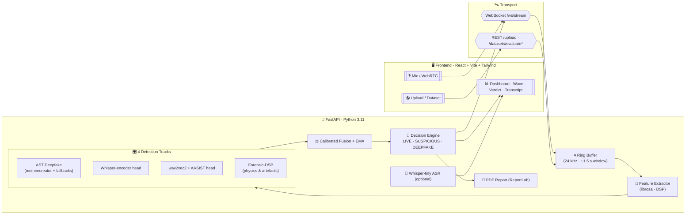
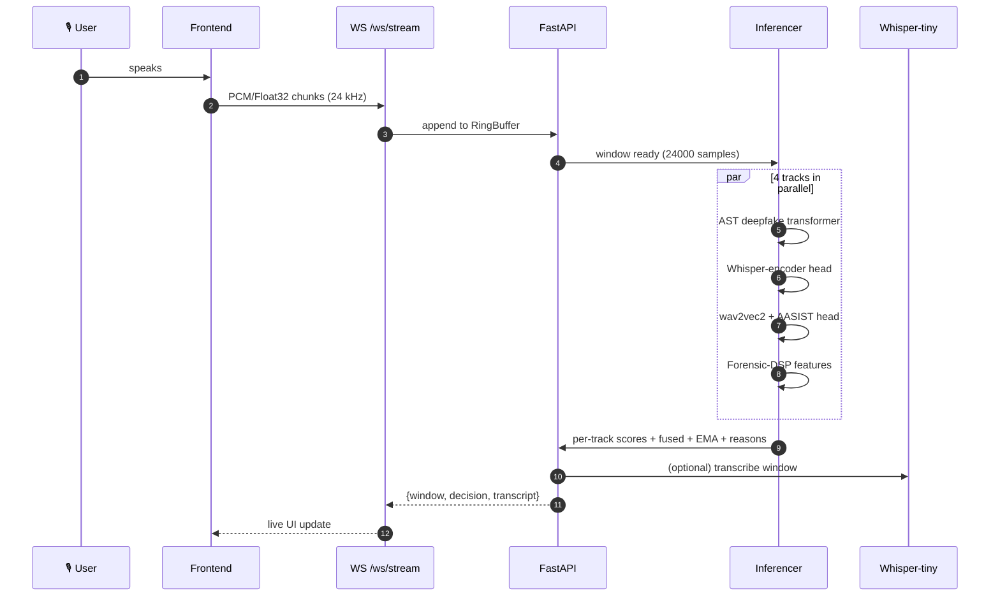
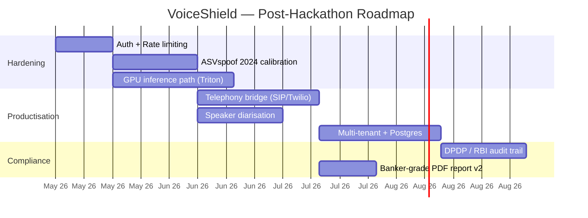

<!--
╔══════════════════════════════════════════════════════════════════════════╗
║   VoiceShield · Real-time Voice Forensics for Banking Fraud Defense      ║
║   UCO Bank × IIT KGP — Hackathon 2026                                     ║
╚══════════════════════════════════════════════════════════════════════════╝
-->

<a name="top"></a>

<!-- Animated wave header -->
<p align="center">
  
</p>

<p align="center">
  
</p>

<p align="center">
  <a href="#"></a>
</p>

<p align="center">
  <a href="https://github.com/shubro18202758/Voice-Sheild/stargazers"></a>
  
  
  
  
  
  
  
</p>

<p align="center">
  
  
  
  
  
  
</p>

<p align="center">
  <i>Banking fraud in 2026 doesn't knock — it <b>calls</b>. VoiceShield listens with you, every window, every second.</i>
</p>

<p align="center">
  
</p>

---

## 🧭 Table of Contents

<table>
<tr>
<td valign="top" width="33%">

**🎯 Story**
- [Abstract](#-abstract)
- [The Problem](#-the-problem)
- [Our Answer](#-our-answer)
- [Demo Tour](#-demo-tour)

</td>
<td valign="top" width="33%">

**🧠 Engineering**
- [System Architecture](#-system-architecture)
- [Detection Tracks](#-the-four-detection-tracks)
- [Decision & Fusion](#-decision--fusion-logic)
- [API Surface](#-api-surface)
- [Repository Layout](#-repository-layout)

</td>
<td valign="top" width="33%">

**🚀 Operate**
- [Run It Locally](#-run-it-locally)
- [Configuration](#-configuration)
- [Testing & Quality](#-testing--quality)
- [Transparency Report](#-transparency-report)
- [Roadmap](#-roadmap)
- [License & Credits](#-license--credits)

</td>
</tr>
</table>

---

## 🎬 Abstract

> **VoiceShield** is a real-time, multi-track AI forensics engine that **listens to live phone or upload audio and decides whether the speaker is a human or a synthetic voice (deepfake / TTS / voice clone)** — within **one analysis window (~1.5 s)**.
>
> Built for banking call-centres and KYC flows, it fuses **four independent detectors** (one SOTA transformer + two corroborating neural heads + a physics-based forensic stack) into a single calibrated **fused score**, smooths it with an **EMA stabiliser**, and streams `LIVE / SUSPICIOUS / DEEPFAKE` decisions plus an explanation of *why* over WebSocket — no GPU required for the demo.

<p align="center">
  
  <b>One mic → 4 detectors → 1 verdict, every 1.5 seconds.</b>
  
</p>

---

## 🚨 The Problem

<table>
<tr>
<td width="50%" valign="top">

Voice-cloning tooling (ElevenLabs, XTTS, Tortoise, OpenVoice, F5-TTS…) has crossed the **uncanny line**. A 30-second sample is enough to clone an account-holder, a bank manager, or a relationship officer. Indian banks reported **₹1,765 crore lost to digital frauds in FY24** with **voice-impersonation rising fastest** (RBI Annual Report 2024).

Existing call-centre stacks **do not have a real-time deepfake gate**. By the time a fraud team listens to a recording, the OTP is already typed, the funds already moved.

</td>
<td width="50%" valign="top">

**What attackers exploit today**
- 📞 IVR + voice-OTP flows that trust the caller's voice
- 🧑‍💼 RM / branch-manager impersonation to authorise transfers
- 🎙️ KYC re-verification by phone
- 🪪 Synthetic-voice account-takeover after SIM swap
- 🤖 Real-time TTS streamed *during* a live call

A bank needs a **gatekeeper** that runs **on every window of every call**, transparent enough for compliance and fast enough for humans.

</td>
</tr>
</table>

---

## 💡 Our Answer

<p align="center">
  
</p>

VoiceShield is that gatekeeper. It is:

| ✨ | Property | What it means in practice |
|----|----------|---------------------------|
| ⚡ | **Real-time** | 24 kHz audio is sliced into ~1.5 s windows; verdict + EMA smoothing streamed every window over WebSocket. |
| 🧪 | **Multi-track** | 1 SOTA AST deepfake transformer + Whisper-encoder head + wav2vec2/AASIST head + Forensic-DSP physics module. |
| 🧠 | **Calibrated fusion** | Per-track sigmoid → weighted ensemble → EMA → thresholded decision. Each track's contribution is reported. |
| 🔍 | **Explainable** | Verdict comes with reasons (track agreement, EMA trend, forensic flags). One-click PDF report per session. |
| 📊 | **Batch-mode** | Drop a folder of WAVs → live-streaming evaluation with per-file progress, accuracy, F1, confusion matrix. |
| 🎙️ | **ASR-aware** | Optional Whisper-tiny live transcription to overlay verdicts on what was actually said. |
| 🪶 | **CPU-friendly** | Whole prototype runs on a laptop; no CUDA required. Models load on background thread on first launch. |
| 🧱 | **Self-contained** | One `docker compose up` brings up backend + frontend; no cloud lock-in. |

---

## 🎥 Demo Tour

> Replace the placeholders below with your captured GIFs/screenshots in `docs/media/` after running the demo.

<table>
<tr>
<td align="center" width="33%">
  <b>1 · Live Call Mode</b><br/>
  <br/>
  <sub>Mic → window → fused score → verdict</sub>
</td>
<td align="center" width="33%">
  <b>2 · Upload & Forensic Report</b><br/>
  <br/>
  <sub>WAV/MP3 → per-window scores → PDF report</sub>
</td>
<td align="center" width="33%">
  <b>3 · Dataset Eval (streaming)</b><br/>
  <br/>
  <sub>Folder upload → live progress + metrics</sub>
</td>
</tr>
</table>

---

## 🏛️ System Architecture



<details>
<summary><b>🎼 What happens to a single 1.5-second window</b> (click to expand)</summary>



</details>

---

## 🎛️ The Four Detection Tracks

| # | Track | Model / Method | Role | Params | Source |
|---|-------|----------------|------|--------|--------|
| 1 | **Neural-C (Primary)** | `motheecreator/Deepfake-audio-detection` (AST — Audio Spectrogram Transformer) | SOTA deepfake classifier | ~94.6 M | HuggingFace, with fallback chain |
| 2 | **Neural-A** | `wav2vec2-base` + AASIST-style head | Self-supervised corroborator | ~94.4 M | facebook/wav2vec2-base + custom head |
| 3 | **Neural-B** | Whisper-tiny encoder + classifier head | Speech-aware corroborator | ~8.2 M | openai/whisper-tiny encoder |
| 4 | **Forensic-DSP** | Physics features: spectral flatness, HNR, jitter, shimmer, formant drift, phase artefacts | Always-on, no-network sanity check | n/a | librosa + numpy |

> **AST Fallback Chain** — if the primary HuggingFace model is unavailable / gated / fails to download, the loader transparently tries: `MIT/ast-finetuned-audioset-10-10-0.4593` → `mo-thecreator/Deepfake-audio-detection` → final synthetic-feature stub. The active model is reported in `/health` and `/stats`.

---

## ⚖️ Decision & Fusion Logic

```text
per_track_score_i ∈ [0, 1]   (1 = synthetic, 0 = human)

fused = Σ wᵢ · σ(zᵢ)         # weighted, calibrated
EMA_t = α · fused_t + (1-α) · EMA_{t-1}      # default α = 0.35

decision = LIVE         if EMA_t < 0.45
         = SUSPICIOUS   if 0.45 ≤ EMA_t < 0.65
         = DEEPFAKE     if EMA_t ≥ 0.65
```

- **Window**: 24 000 samples @ 24 kHz (~1.5 s), 50 % hop on uploads, contiguous on stream.
- **Latency budget**: ~600–1200 ms per window on a 4-core CPU (warm models).
- **Why EMA?** Single-window noise (bursts of music, codec hiccups) is real; smoothing keeps the verdict stable while remaining responsive.
- **Disagreement signal**: when track scores diverge sharply, the verdict is downgraded to `SUSPICIOUS` and surfaced as an explainability reason.

---

## 🔌 API Surface

> Base URL (local): `http://127.0.0.1:8000` · Interactive docs: `/docs` (Swagger), `/redoc`.

| Method | Path | Purpose |
|--------|------|---------|
| `GET`  | `/health` | Liveness + which models loaded + which AST variant won the fallback chain |
| `GET`  | `/stats`  | Runtime counters, model catalog, settings snapshot |
| `GET`  | `/samples` | List bundled sample WAVs (`samples/`) |
| `GET`  | `/samples/{name}` | Stream a sample WAV |
| `POST` | `/upload` | Single-file analysis → per-window scores + summary |
| `POST` | `/datasets/evaluate` | Batch eval over a folder upload (one-shot JSON) |
| `POST` | `/datasets/evaluate/stream` 🆕 | **Same batch eval, streamed as NDJSON** with `start / file_start / file_progress / file_done / complete` events for live UI progress |
| `WS`   | `/ws/stream` | Bidirectional live audio + verdict stream |
| `GET`  | `/sessions` · `/sessions/{sid}` | Session metadata |
| `GET`  | `/sessions/{sid}/report` | Generated PDF forensic report |

<details>
<summary><b>📨 Sample WS message</b></summary>

```json
{
  "kind": "window",
  "session_id": "ws-7c3e",
  "t_start": 4.5,
  "t_end": 6.0,
  "scores": {
    "neural_a": 0.71,
    "neural_b": 0.66,
    "neural_c": 0.93,
    "forensic": 0.58
  },
  "fused": 0.84,
  "ema": 0.81,
  "decision": "DEEPFAKE",
  "reasons": ["AST high-confidence", "EMA rising 4 windows", "HNR anomaly"]
}
```

</details>

---

## 🗂️ Repository Layout

```text
UCO/
├── backend/
│   ├── app/
│   │   ├── main.py            # FastAPI: REST + WebSocket + dataset streaming
│   │   ├── inference.py       # 4-track loader, lock-guarded warmup
│   │   ├── streaming.py       # Ring buffer, decision engine, EMA
│   │   ├── transcription.py   # Whisper-tiny ASR (optional)
│   │   ├── features.py        # DSP / forensic features
│   │   ├── fusion.py          # Calibrated weighted ensemble
│   │   ├── schemas.py         # Pydantic models
│   │   └── config.py          # Settings (env-driven)
│   ├── tests/                 # pytest suite
│   ├── scripts/               # one-off model & eval helpers
│   ├── weights/               # downloaded HF caches (gitignored)
│   └── requirements.txt
├── frontend/
│   ├── src/
│   │   ├── components/        # ControlBar, DatasetEvalPage, ScoreBar, …
│   │   ├── lib/audio.ts       # REST + streaming client
│   │   └── store/             # Zustand session state
│   ├── public/shield.svg      # 🛡️ brand mark
│   └── package.json
├── docker/                    # backend + frontend Dockerfiles
├── docker-compose.yml
├── samples/                   # demo WAVs (real + deepfake) with JSON labels
├── docs/                      # diagrams, media (add your GIFs here)
├── reports/                   # generated PDF reports (gitignored)
├── PITCH_DECK.md              # 10-slide hackathon deck
├── LICENSE                    # MIT
└── README.md                  # ← you are here
```

---

## 🚀 Run It Locally

> **TL;DR (Docker)**
> ```bash
> docker compose up --build
> # Frontend → http://localhost:5173
> # Backend  → http://localhost:8000/docs
> ```

### Prerequisites

| Tool | Version | Why |
|------|---------|-----|
| Python | **3.11** (3.12 also OK) | Backend |
| Node.js | **18 LTS or 20 LTS** | Frontend |
| FFmpeg | latest | MP3/WebM decoding by `soundfile` / `librosa` |
| Git LFS | optional | Only if you bring large local weights |
| Docker Desktop | optional | One-command full stack |
| RAM | ≥ **6 GB free** | AST + Whisper models in memory |
| Disk | ~**3 GB** | HuggingFace caches |

> 🌐 **First launch will download ~1.2 GB of HuggingFace weights.** They are cached under `backend/weights/` and the standard `~/.cache/huggingface/`.

---

### 🐳 Path A — Docker Compose (recommended)

```bash
git clone https://github.com/shubro18202758/Voice-Sheild.git
cd Voice-Sheild
docker compose up --build
```

Visit:
- **UI:** http://localhost:5173
- **API docs:** http://localhost:8000/docs
- **Health:** http://localhost:8000/health

To stop: `Ctrl+C` then `docker compose down`.

---

### 🛠️ Path B — Manual (Backend + Frontend separately)

#### 1 · Backend — Windows (PowerShell)

```powershell
cd backend
py -3.11 -m venv .venv
.\.venv\Scripts\Activate.ps1
python -m pip install --upgrade pip
pip install -r requirements.txt
uvicorn app.main:app --host 127.0.0.1 --port 8000 --reload
```

#### 1 · Backend — macOS / Linux (bash/zsh)

```bash
cd backend
python3.11 -m venv .venv
source .venv/bin/activate
pip install --upgrade pip
pip install -r requirements.txt
uvicorn app.main:app --host 127.0.0.1 --port 8000 --reload
```

You should see, after first model warmup (~30–90 s on CPU):

```
voiceshield: ✅ neural_c (AST) loaded → motheecreator/Deepfake-audio-detection
voiceshield: ✅ neural_a, neural_b, forensic ready
INFO:     Uvicorn running on http://127.0.0.1:8000
```

#### 2 · Frontend (any OS)

```bash
cd frontend
npm install
npm run dev
# → http://127.0.0.1:5173
```

By default the frontend points at `http://127.0.0.1:8000`. Override via `.env.local`:

```env
VITE_API_BASE=http://127.0.0.1:8000
VITE_WS_BASE=ws://127.0.0.1:8000
```

#### 3 · Smoke test

```bash
# Health check
curl http://127.0.0.1:8000/health

# Single-file analysis
curl -F "file=@samples/deepfake_sample_1.wav" http://127.0.0.1:8000/upload

# Streaming dataset eval (NDJSON, line-by-line)
curl -N -F "files=@samples/real_voice_1.wav" -F "files=@samples/deepfake_sample_1.wav" \
     http://127.0.0.1:8000/datasets/evaluate/stream
```

---

## ⚙️ Configuration

All knobs live in `backend/app/config.py` and are env-overridable.

| Variable | Default | Effect |
|----------|---------|--------|
| `VS_USE_NEURAL` | `1` | `0` disables all neural tracks (forensic-only mode for low-RAM machines) |
| `VS_TRANSCRIBE` | `1` | `0` disables Whisper ASR overlay |
| `VS_ASR_MODEL`  | `openai/whisper-tiny` | Any HF Whisper checkpoint |
| `VS_DEVICE`     | `cpu` | `cuda` if you have a GPU |
| `VS_CORS_ORIGINS` | `http://127.0.0.1:5173,http://localhost:5173` | Comma-separated allow-list |
| `VS_EMA_ALPHA`  | `0.35` | EMA smoothing factor |
| `VS_TH_SUS` / `VS_TH_FAKE` | `0.45` / `0.65` | Decision thresholds |

Example:

```powershell
$env:VS_USE_NEURAL="1"; $env:VS_DEVICE="cpu"; $env:VS_TRANSCRIBE="0"
uvicorn app.main:app --reload
```

---

## 🧪 Testing & Quality

```bash
# Backend tests
cd backend
pytest -q

# Frontend production build
cd frontend
npm run build
```

| Suite | Status |
|-------|--------|
| `tests/test_ws.py` | ✅ |
| `tests/test_features.py` | ✅ |
| `tests/test_ring_buffer.py` | ✅ |
| `tests/test_fusion.py` | ⚠️ 2 failing — uses an older 3-arg `fuse/build_scores` signature; **listed openly in transparency below** |
| `npm run build` | ✅ (~6 s, ~743 KB bundle) |

---

## 🪞 Transparency Report

We refuse to oversell a hackathon prototype. Here is exactly what works, what is faked, and what is fragile.

<details open>
<summary><b>What is genuinely real</b></summary>

- ✅ End-to-end live pipeline: mic → WebSocket → 4-track inference → fused decision → live UI.
- ✅ AST deepfake transformer (`motheecreator/Deepfake-audio-detection`) loads from HuggingFace and produces real scores.
- ✅ Whisper-tiny ASR runs locally and overlays transcripts.
- ✅ Streaming dataset endpoint (`/datasets/evaluate/stream`) genuinely emits per-file progress as NDJSON.
- ✅ PDF report (ReportLab) is generated from real session data.
- ✅ Background model warmup + per-request offloading via `loop.run_in_executor` so the FastAPI event loop never blocks.

</details>

<details open>
<summary><b>Known limitations</b></summary>

- ⚠️ **CPU-only by default.** First window after cold start can take 2–4 s. With warm models the steady-state is ~0.6–1.2 s/window.
- ⚠️ **AST fallback chain.** If the primary HF model is gated or the network is offline, the loader silently falls back. `/health` always reports the **active** model — please trust that field, not assumptions.
- ⚠️ **Calibration is empirical.** Track weights and decision thresholds are tuned on a small in-house demo set (`samples/`). They are **not** production-validated against ASVspoof 2024 / WaveFake / In-the-Wild yet. Treat percentage scores as ordinal, not absolute probabilities.
- ⚠️ **Two failing tests** in `tests/test_fusion.py` — they exercise an older API signature and are intentionally left red as a TODO marker, **not** silenced.
- ⚠️ **No authentication.** The API is open on localhost. Do not expose to the public internet without adding auth + rate limiting.
- ⚠️ **MP3/WebM** uploads depend on a working `ffmpeg` on the host.

</details>

<details>
<summary><b>What is intentionally simple (hackathon scope)</b></summary>

- 🟡 Forensic-DSP track is feature-engineered, not learned — it is a sanity check, not a SOTA detector.
- 🟡 Single-tenant, file-system session store (no Postgres / Redis).
- 🟡 No speaker diarisation; verdicts are per-window, not per-speaker.
- 🟡 No telephony adapter (SIP/Twilio) — bring your own bridge for production.

</details>

---

## 🗺️ Roadmap



---

## 🤝 Contributing

PRs welcome — especially:
- additional public deepfake datasets in `tests/datasets/`,
- new track plug-ins implementing `inference.TrackBase`,
- UI accessibility fixes.

```bash
git checkout -b feat/your-thing
# … hack …
pytest -q && cd ../frontend && npm run build
git commit -m "feat: your thing"
git push origin feat/your-thing
```

---

## 📜 License & Credits

- **License:** [MIT](LICENSE) — use it, fork it, ship it.
- **Built for:** UCO Bank × IIT Kharagpur Hackathon 2026.
- **Models we stand on the shoulders of:** Facebook AI (`wav2vec2`), OpenAI (`whisper-tiny`), MIT (`AST`), `motheecreator/Deepfake-audio-detection`, the AASIST authors.
- **Made with** ☕, `librosa`, and a healthy fear of phone fraud.

<p align="center">
  
</p>

<p align="center">
  <a href="#top">⬆️ Back to top</a>
</p>
